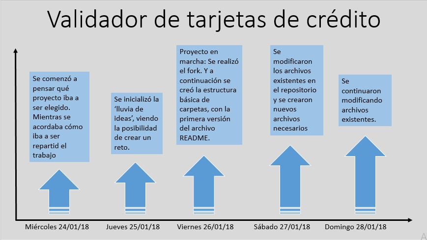

# Validador de datos de tarjetas de crédito

* **Track:** _Common Core_
* **Curso:** _JS Deep Dive: Crea tu propia librería usando JavaScript_
* **Unidad:** _Producto final_
* **Integrantes:** _Yosseline Apcho Huaman, Tahirih Jaliri Pancca._

***

## Objetivo:

- Construir una librería (library) que responda a los requisitos del reto.

***

## Requisitos:

1. El reto debe incluir los siguientes archivos:

* README.md con descripción del módulo, instrucciones de instalación, uso y documentación del API.

* index.js: Librería debe exportar una función u objeto al entorno global (window) y hacer uso de features de ES6 donde sea apropiado.

* index.html: Página web de la librería con ejemplo funcionando.

* package.json con nombre, versión, descripción, autores, licencia, dependencias, scripts (pretest, test, ...)

* .eslintrc con configuración para linter.

* .gitignore para ignorar node_modules u otras carpetas que no deban incluirse en control de versiones (git).

1.1 Hacker edition (opcional):

* Si la librería está dirigida al navegador, debe adherirse al patrón UMD para poder ser usado con AMD, CommonJS y como variable global del navegador.

* Integración continua con Travis o Circle CI.

***

2. El plugin debe recibir una referencia a un elemento del DOM que contenga `<input>`s con los siguientes nombres (atributo `name`):

* `cn` (Card Number): El número de la tarjeta de crédito
* `exp` (Expiry Date): Fecha de expiración
* `cvv` (Card Verification Value): Código de validación de 3 dígitos
* `name`: Nombre completo como aparece en la tarjeta

## Ejemplo

```html
<form>
  <div class="form-group">
    <label for="cn">Número de tarjeta</label>
    <input id="cn" name="cn" />
  </div>
  <div class="form-group">
    <label for="exp">Fecha de vencimiento</label>
    <input id="exp" name="exp" />
  </div>
  <div class="form-group">
    <label for="cvv">CVV</label>
    <input id="cvv" name="cvv" />
  </div>
  <div class="form-group">
    <label for="name">Nombre completo</label>
    <input id="name" name="name" />
  </div>
  <input type="submit" value="Pagar" />
</form>
```

```js
const form = document.querySelector('form');

form.addEventListener('submit', (e) => {
  e.preventDefault();
  if (validateCardDetails(form)) {
    console.log('datos válido... enviar...');
  } else {
    console.log('datos inválidos');
  }
});
```

3. A la hora de hacer las validaciones, la librería debería de añadir la clase
`.error` a los `<input>`s que no pasen la validación, o la clase `.success`
en caso de que sí pase.

***

## Proceso (PLANIFICACIÓN):

### Día 1:

**MIÉRCOLES: 24/01/2017**

- Se formó el equipo, conformado por:
  Yosseline Apcho Huaman
  Tahirih Jaliri Pancca

### Día 2:

**JUEVES: 25/01/2017**

- Se seleccionó el reto:
  Por unanimidad, el reto seleccionado fue: 'Validación de tarjetas de crédito'.

### Día 3:

**VIERNES: 26/01/2017**

- Se realizó la repartición equitativa del proyecto. Acordando que ambas integrantes indagarián más sobre las herramientas nuevas que iban a usar.

### Día 4:

**SÁBADO: 27/01/2017**

- Se realizó el fork del repositorio modelo.

- Se realizó una 'lluvia de ideas' para el proyecto.

- Se procedió a iniciar el proyecto, creando una estructura básica de carpetas, junto con la primera versión de README.

### Día 5:

**DOMINGO: 28/01/2017**

- Se continuaron con las mejoras del README, se crearon y/o modificaron nuevos archivos necesarios.

***

## Milestone:



## Algoritmo de Luhn:

La construcción de la librería se basa en el algoritmo de Luhn, este algoritmo es una fórmula de suma de verificación, utilizada para validar una diversidad de números de identificación; como números de tarjetas de crédito, números IMEI, etc.
El Algoritmo Luhn se basa en el concepto de módulo 10, pero lo modifica para darle robustez. La idea se basa en hacer una suma ponderada multiplicando dígitos adyacentes por constantes distintas (en este caso 1 o 2) para detectar el intercambio de éstos. Los pasos son los siguientes:

  1. Se multiplican los dígitos impares por 2.
  2. Si del producto resultan dos dígitos, sus cifras se suman para obtener un único término.
  3. Se suman todos los términos pares e impares.
  La secuencia será correcta si la suma es un múltiplo de 10, es decir, su resto es cero.

***

## Snippets:

//Este es un ejemplo de snippet, que será modificado para mejorar la librería.

```
validateCardNumber('id input tarjeta') // 25467589647
expiryDate(id input fecha expiración) //  20-14-18
cardVerificationValue(id input número verificación tarjeta) // 456
nameUser(id input nombre usuario) // Tatiana Rojas
```

***

## Herramientas utilizadas:

- EC6.

- HTML5.

- CSS3.

- Materialize.

- jQuery.
